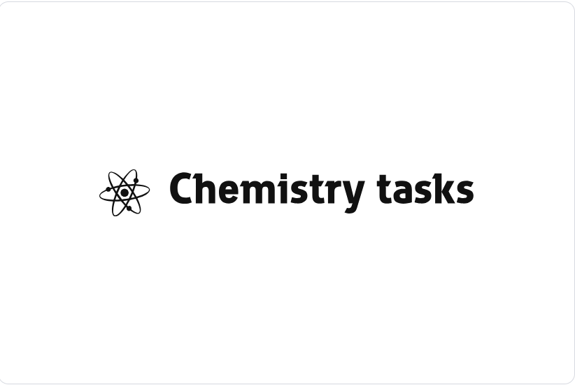
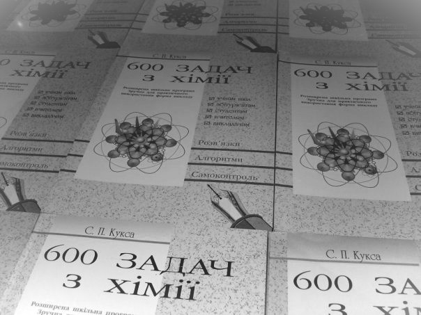

# **600 CHEMISTRY TASKS**

**Author:** Serhii Kuksa

**Description:**
"600 Chemistry Tasks" is a comprehensive book authored by Serhii Kuksa, initially published in 1998 and continuously updated with new editions every year. Widely available across cities in Ukraine, this book presents a set of 600 chemistry tasks designed to enhance understanding and proficiency in the subject. Each task comes with detailed step-by-step explanations, providing learners with clarity on how to solve them effectively. At the end of the book, there is an answer key for reference, enabling readers to check their work and reinforce their learning. With the latest version now available, the book has been further improved to provide an even more enriching learning experience for chemistry students.

**Features:**

- 600 chemistry tasks
- Detailed step-by-step explanations
- Answer key included
- Continuously updated with new editions

# 600 CHEMISTRY TASKS
